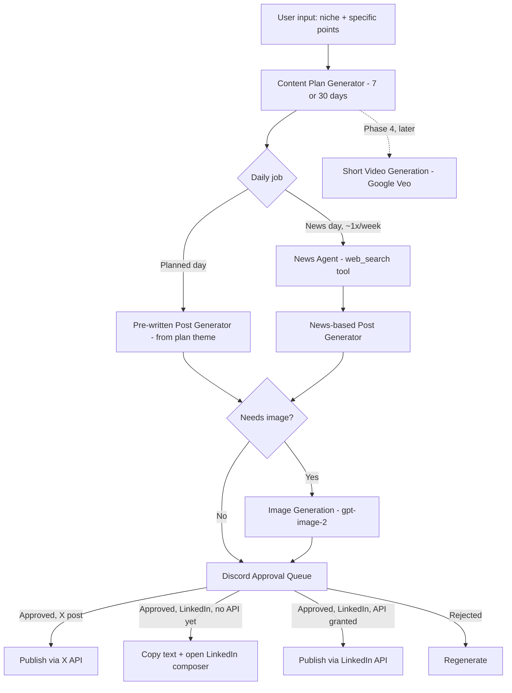

# Personal Branding / Social Automation Agent — PRD

Final-year Applied AI project (v1). This spec is written for a coding agent (commandcode) to build against under spec-driven development.

---

## 1. Verdict on the pivot

**Why it's better:** nobody bundles this into a free office suite the way slide generation got bundled. People demonstrably pay for LinkedIn/X content automation — Taplio, Kleo, MagicPost, TweetHunter, and general schedulers like Buffer/Hootsuite/SocialPilot all monetize this today, with real pricing ($25–$180+/month). That's a healthier signal than presentations had.

**Why it's still crowded:** those same tools already do "content plan → AI-written posts → scheduled/auto-publish." Kleo and Taplio in particular are well-funded and specifically built around personal branding. Copying their feature list won't be a strong "real problem" story in your defense.

**What's actually different about your spec, and worth leaning into:**
- Discord-based approval instead of a web dashboard — genuinely uncommon in this category, and a good showcase of agentic/bot engineering if you build it well
- The news-scraping reactive post agent — most competitors lean on evergreen templates, not live "what's happening in your niche right now"
- Pick a specific underserved audience for your report's framing rather than "founders/creators" (already saturated) — e.g. students and early-career job seekers building a LinkedIn presence while job hunting is a specific, real, testable-on-your-own-classmates problem

## 2. Publishing strategy — now vs. once LinkedIn API access arrives

LinkedIn's Community Management API application is in progress in parallel and no longer blocks starting Phase 1 — the two platforms get different treatment until it comes through:

- **X (Twitter):** build real API auto-publish now. X API access is just a developer account + billing, not a review gate. Budget for it: the API lost its free tier in Feb 2026, it's pay-per-use at roughly $0.015/post (more with a link) — a real per-user cost to account for in pricing, not an afterthought.
- **LinkedIn (until API access arrives):** there's no true one-click publish without the API — LinkedIn's share URL only supports sharing a link with an auto-generated preview, it can't prefill custom post text the way X's compose-intent link can. Interim flow: Discord "Approve" copies the post text to the clipboard and opens LinkedIn's post composer — the user pastes and clicks Post. Two actions, not zero, but no API dependency.
- **Once LinkedIn API access is granted:** swap the LinkedIn branch from copy-and-paste to a real API call behind the same "Approve" button — no change needed anywhere else (see §4 and §6 for how the publish step is built so that swap stays small).
- Regardless of platform or method: never build around browser automation / logging in as the user to click "post" on their behalf outside an official API — against both platforms' user agreements, and the ban risk lands on your *user's* account, not just your app.

## 3. Tech stack

| Layer | Choice | Notes |
|---|---|---|
| Frontend | Next.js + Tailwind + shadcn/ui | Dashboard for plan review, settings, history |
| Backend | Express.js | Separate from Next.js for clear backend design |
| Database | MongoDB Atlas (free M0) | Not self-hosted |
| Auth | JWT + bcrypt | Plus OAuth for LinkedIn/X connections |
| Approval channel | Discord bot (discord.js) | Buttons/components for Approve / Reject / Edit |
| Content plan + post generation | OpenAI API, structured outputs | Cheap text-tier model; one JSON schema per content type |
| News-reactive agent | OpenAI Responses API `web_search` tool | Built-in, no separate scraper needed for MVP; swap for NewsAPI.org/RSS later if you need source control or lower cost at volume |
| Short images | `gpt-image-2` | Sized per platform (square for feed, etc.) |
| Short video (later phase) | **Not Sora** — OpenAI's Sora API is being shut down Sep 24, 2026. Use Google Veo (Gemini API) when you get to this phase | Don't build against a dying API |
| Scheduling | BullMQ + Redis (or node-cron for simplicity) | Daily post-generation job, per user, per plan |
| Payments | Stripe (test mode for demo) | Needed for real launch given per-post X costs, optional for the academic deliverable |
| Hosting | University server | PM2 + Nginx + Certbot, same as before |

## 4. Architecture



**Content mix assumption (confirm or adjust):** the spec says "3 posts/week = 2 pre-written + 1 news." Generalized here as: **1 news-agent post per week, fixed, regardless of weekly frequency; the rest are pre-written from the plan.** So 2/week = 1 planned + 1 news, 3/week = 2 planned + 1 news, 4/week = 3 planned + 1 news. Change this in the config if you meant a different ratio.

## 5. Data models

```
User {
  _id, name, email, passwordHash,
  niche, inputPoints: [String],
  postFrequency: 2 | 3 | 4,           // per week
  linkedin: { accessToken, refreshToken, expiresAt },
  x: { accessToken, refreshToken, expiresAt },
  discordUserId,
  plan: 'free' | 'pro',
  createdAt
}

ContentPlan {
  _id, userId,
  durationDays: 7 | 30,
  days: [{ dayIndex, theme, type: 'planned' | 'news', status: 'pending' | 'generated' }],
  status: 'draft' | 'approved',
  createdAt
}

Post {
  _id, planId, userId, dayIndex,
  platform: 'linkedin' | 'x',
  type: 'planned' | 'news',
  sourceNewsUrl,                       // only for type: 'news'
  content, imageUrl,
  status: 'pending_approval' | 'approved' | 'rejected' | 'published',
  publishMethod: 'api' | 'assisted',   // x: always 'api'; linkedin: 'assisted' until API access lands, then 'api'
  discordMessageId,
  scheduledFor, publishedAt
}
```

## 6. Feature specs by phase

### Phase 1 — Content plan + Discord approval + publish (core MVP)
- Input: niche string + array of specific points/topics
- Generate a 7-day **or** 30-day plan: array of `{dayIndex, theme, type}` using the content-mix rule in §4
- Daily job generates that day's full post text (planned or news-based)
- Discord bot DMs/posts the draft (text + image if applicable) with Approve/Reject buttons
- Reject → regenerate and re-send
- Approve triggers publish immediately, one action from the user's side, method depends on platform: X calls the real API and publishes; LinkedIn copies the text to clipboard and opens the LinkedIn post composer for the user to paste and click Post
- **Done when:** a full plan cycle runs end to end — X posts go live automatically on approval, LinkedIn posts are one paste-and-click away right after approval

### Phase 2 — LinkedIn API integration (once Community Management API access is granted)
- Per-user LinkedIn OAuth connect flow
- Swap the LinkedIn branch in the Approve handler from copy-and-paste to a real API call — same button, same data model, just a different `publishMethod`
- **Done when:** approved LinkedIn posts publish automatically, matching what X already does

### Phase 3 — Image generation
- `gpt-image-2` call when a post is flagged as needing an image, sized for the target platform
- Per-user daily/weekly image cap
- **Done when:** eligible posts get an appropriate image attached before hitting the Discord queue

### Phase 4 — Short video (later, explicitly deferred)
- Use Google Veo (Gemini API) — not Sora, which is being retired
- Revisit scope and pricing when you get here; video cost-per-second is high across every provider, so this will need its own credit/pricing pass

## 7. Cost & rate controls

- X: budget ~$0.015/published post per user; this needs to show up in your pricing/credit model, it's not negligible at volume
- LinkedIn: no per-post API cost once access is granted; free in the meantime since the assisted flow doesn't call the API at all
- OpenAI text + news-search calls: cheap per call, but cap plan-regenerations and news-lookups per user per day
- Images: default medium quality, cap per user per week
- Hard spend cap in the OpenAI dashboard before any public/demo link goes out

## 8. Deployment

Same as before: PM2 + Nginx + Certbot on the university server, MongoDB on Atlas, secrets in `.env`, confirm outbound HTTPS isn't firewalled (now needs to reach `api.openai.com`, LinkedIn's API, and X's API — check all three).

## 9. Milestones

| Weeks | Work |
|---|---|
| 1 | X developer account + billing set up, LinkedIn API application submitted (runs in parallel, non-blocking), niche/audience locked, repo scaffold |
| 2–4 | Phase 1 — content plan generator + Discord approval loop, X real publish, LinkedIn assisted one-click publish |
| — | Phase 2 — LinkedIn API integration, whenever access is granted (parallel track, not gating the weeks below) |
| 5–6 | Phase 3 — image generation |
| 7 | Deploy to university server |
| 8–10 | Bug fixes, report, demo prep |
| Stretch | Phase 4 — video via Veo, only if time and API access allow |

## 10. Risks & open questions

- LinkedIn posts stay a manual paste-and-click until API access arrives — factor that into how you demo this in your defense (X can be shown fully automatic, LinkedIn can't yet)
- Content-mix ratio (§4) is an assumption — confirm before building the scheduler around it
- X per-post cost needs a pricing/credit answer before real users touch this
- Sora API shuts down Sep 24, 2026 — Phase 4 must target Veo or another live provider, not Sora
- Niche/audience for the report still needs picking (§1)
